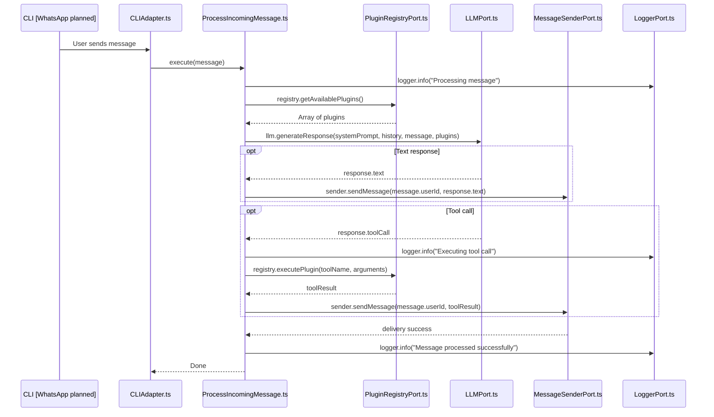

# System Architecture

## 1. System Vision & The Hexagonal Boundary

Iny serves as a highly modular, zero-trust WhatsApp bot engine powered by LLMs. Our core philosophy relies heavily on Hexagonal Architecture (Ports and Adapters). The **Domain Core** (`src/core`) contains zero external dependencies and remains pure. It dictates the business logic and how messages should be processed. Adapters handle all interaction with the outside world (like WhatsApp, CLI, LLMs, and external plugins) by implementing interfaces (ports) defined by the core.

## 2. Mental Model & Core Concepts

- **Entity**: Central data structures representing domain concepts, like `src/core/entities/Message.ts`.
- **Use Case**: Application-specific business rules. `src/core/use-cases/ProcessIncomingMessage.ts` orchestrates the flow of reading a message, fetching tools, querying the LLM, and sending the response.
- **Ports**: Interfaces that define how the core communicates with the outside world without knowing implementation details.
  - `src/core/ports/MessageSenderPort.ts`
  - `src/core/ports/LLMPort.ts`
  - `src/core/ports/LoggerPort.ts`
  - `src/core/ports/PluginRegistryPort.ts`
- **Inbound Adapters**: Entry points that trigger core use cases. For example, `src/adapters/inbound/cli/CLIAdapter.ts` simulates user interaction via the command line.
- **Outbound Adapters**: Concrete implementations of our core ports that interact with external services.
  - `src/adapters/outbound/llm/DeepseekAdapter.ts`
  - `src/adapters/outbound/logger/PinoLoggerAdapter.ts`
  - `src/adapters/outbound/plugin-registry/InMemoryPluginRegistry.ts`
- **Plugins**: Modular tool extensions available to the LLM, such as `src/plugins/CalculatorPlugin.ts`.

## 3. Codebase Directory Map

```text
src/
├── core/                           # The Pure Domain Core (Zero External Dependencies)
│   ├── entities/
│   │   └── Message.ts              # Domain entities
│   ├── use-cases/
│   │   └── ProcessIncomingMessage.ts # Core business logic
│   ├── ports/                      # Interfaces for external dependencies
│   │   ├── LLMPort.ts
│   │   ├── LoggerPort.ts
│   │   ├── MessageSenderPort.ts
│   │   └── PluginRegistryPort.ts
│   └── errors/
│       └── LLMErrors.ts            # Custom domain errors
├── adapters/                       # Interaction with the outside world
│   ├── inbound/
│   │   └── cli/
│   │       └── CLIAdapter.ts       # Command line interface for manual testing
│   └── outbound/
│       ├── llm/
│       │   └── DeepseekAdapter.ts  # Deepseek LLM integration
│       ├── logger/
│       │   └── PinoLoggerAdapter.ts# Logging using Pino
│       └── plugin-registry/
│           └── InMemoryPluginRegistry.ts # Manages available plugins
├── plugins/
│   └── CalculatorPlugin.ts         # Example plugin (tool) for the LLM
├── config.ts                       # Fail-fast configuration with Zod
└── index.ts                        # The Composition Root
```

## 4. Canonical Control & Data Flow



## 5. Architectural Invariants

- **Pure Core**: `src/core/` must never import from outside of itself. It contains solely TypeScript interfaces, classes, and types.
- **Single Composition Root**: In production runtime code, `src/index.ts` is the only place where adapters and the core are stitched together. Dependency injection is wired up here (unit tests and internal adapter factory methods like `PinoLoggerAdapter.child()` may instantiate adapters directly).
- **Fail-Fast Startup**: `src/config.ts` uses Zod to validate all environment variables at startup. If configuration is invalid, the application fails immediately before any business logic is executed.

## 6. "How Do I..." Recipe Guide

### Recipe 1: Add Inbound Adapter
1. Create a new directory in `src/adapters/inbound/` (e.g., `whatsapp/`).
2. Write an adapter class that takes use cases (e.g., `ProcessIncomingMessage`) as dependencies.
3. Listen to external events (like a webhook or socket message) and invoke the use case.
4. Wire it up in `src/index.ts`.

### Recipe 2: Add Outbound Port & Adapter
1. Define the port interface in `src/core/ports/` (e.g., `DatabasePort.ts`).
2. Create the adapter in `src/adapters/outbound/` (e.g., `postgres/PostgresAdapter.ts`) implementing the port.
3. Inject it into the necessary use cases via `src/index.ts`.

### Recipe 3: Create Plugin/Tool
1. Create a new plugin in `src/plugins/` (e.g., `WeatherPlugin.ts`).
2. Ensure it adheres to the plugin interface required by `PluginRegistryPort`.
3. Register the plugin with the plugin registry adapter in `src/index.ts`.

### Recipe 4: Finalize Feature & Atomic Spec Archival
1. Ensure full test coverage (`npm test`) and build success (`npm run build`).
2. Move the active specification from `docs/specs/` to `docs/specs/archive/` within the same feature branch.
3. Commit and submit pull request.
