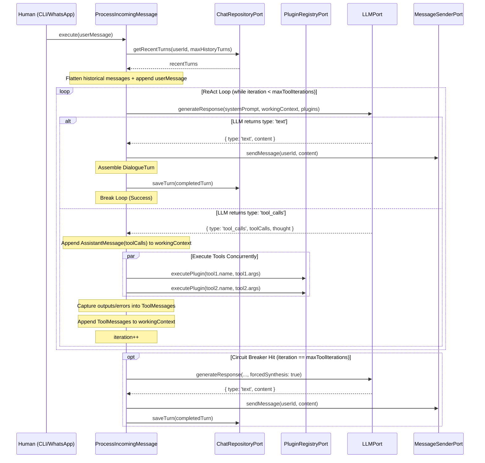

# Multi-Turn Conversation Memory & Agentic Tool Loop Specification

## 1. Overview & Business Objectives

Iny aims to be a zero-friction, intelligent assistant for college students. Currently, Iny operates on a single-turn basis (forgetting context between messages) and terminates abruptly whenever a tool is called by sending raw tool output strings directly to the user.

This specification defines the architecture, domain entities, ports, and orchestration logic for:
1. **Multi-Turn Conversation Memory**: Preserving context across conversation turns while enforcing turn-atomic boundaries to prevent API errors and token inflation.
2. **First-Class `DialogueTurn` Abstraction**: Eliminating fragile sliding-window slicing by modeling dialogue as atomic turn transactions.
3. **Closed ReAct Tool Loop**: Allowing the LLM to autonomously reason, call tools, inspect tool results (or error messages), and synthesize friendly, conversational responses.
4. **Safety & Cost Circuit Breakers**: Guarding against runaway agent loops with configurable iteration ceilings and graceful forced synthesis.
5. **In-Memory Driven Adapter**: Providing a zero-overhead, highly testable `InMemoryChatRepository` adapter adhering to Hexagonal Architecture, fully swappable for PostgreSQL in production.

---

## 2. Architectural Map & Invariants

```text
src/
├── core/
│   ├── entities/
│   │   ├── Message.ts                  # Discriminated union: User, Assistant, Tool
│   │   └── DialogueTurn.ts             # First-class atomic turn entity
│   ├── ports/
│   │   ├── ChatRepositoryPort.ts       # Domain interface for turn persistence
│   │   ├── LLMPort.ts                  # Updated for full turn history & discriminated response
│   │   ├── LoggerPort.ts               # Existing logger port
│   │   ├── MessageSenderPort.ts        # Existing sender port
│   │   └── PluginRegistryPort.ts       # Existing plugin registry port
│   ├── errors/
│   │   └── LLMErrors.ts                # Existing domain errors
│   └── use-cases/
│       └── ProcessIncomingMessage.ts   # ReAct loop orchestrator
├── adapters/
│   ├── inbound/
│   │   └── cli/
│   │       └── CLIAdapter.ts           # Inbound terminal driver
│   └── outbound/
│       ├── chat-repository/
│       │   └── InMemoryChatRepository.ts # Memory adapter for turns
│       ├── llm/
│       │   └── DeepseekAdapter.ts      # Multi-turn, parallel tool calls, finish_reason mapping
│       ├── logger/
│       │   └── PinoLoggerAdapter.ts    # Logger adapter
│       └── plugin-registry/
│           └── InMemoryPluginRegistry.ts # Plugin registry adapter
├── plugins/
│   └── CalculatorPlugin.ts             # Arithmetic tool
├── config.ts                           # Zod validation with MAX_TOOL_ITERATIONS & MAX_HISTORY_TURNS
└── index.ts                            # Composition root wiring
```

### Architectural Invariants
1. **Hexagonal Purity**: `src/core/` contains strictly TypeScript types, interfaces, and classes. Zero external dependencies.
2. **Turn-Atomic Integrity**: Conversation history loaded into the LLM prompt must always consist of whole dialogue turns. An assistant tool-call message must never be orphaned from its corresponding tool-result messages.
3. **Single Point of Commitment**: The repository is updated only upon successful completion of a dialogue turn. Failed or aborted turns do not corrupt conversational memory.
4. **Strict Discriminated Contracts**: `LLMResponse` and `Message` use TypeScript discriminated unions (`type` and `role`) rather than loose optional properties.

---

## 3. Core Entities & Types

### 3.1. `src/core/entities/Message.ts`

```typescript
export interface ToolCall {
  id: string;
  name: string;
  arguments: Record<string, unknown>;
}

export interface BaseMessage {
  id: string;
  userId: string;
  timestamp: Date;
}

export interface UserMessage extends BaseMessage {
  role: 'user';
  content: string;
}

export interface AssistantMessage extends BaseMessage {
  role: 'assistant';
  content?: string;
  thought?: string;
  toolCalls?: ToolCall[];
}

export interface ToolMessage extends BaseMessage {
  role: 'tool';
  toolCallId: string;
  name: string;
  content: string;
}

export type Message = UserMessage | AssistantMessage | ToolMessage;
```

### 3.2. `src/core/entities/DialogueTurn.ts`

```typescript
import { Message } from './Message';

export interface DialogueTurn {
  id: string;
  userId: string;
  /**
   * Complete, atomic sequence of messages for this turn:
   * [UserMessage, ...(AssistantMessage(toolCalls) + ToolMessage)*, AssistantMessage(final)]
   */
  messages: Message[];
  createdAt: Date;
}
```

---

## 4. Core Ports & Contracts

### 4.1. `src/core/ports/ChatRepositoryPort.ts`

```typescript
import { DialogueTurn } from '../entities/DialogueTurn';

export interface ChatRepositoryPort {
  /**
   * Retrieves the most recent dialogue turns for a user, ordered chronologically (oldest to newest).
   * @param userId The unique user identifier.
   * @param maxTurns Maximum number of complete turns to retrieve.
   */
  getRecentTurns(userId: string, maxTurns: number): Promise<DialogueTurn[]>;

  /**
   * Atomically persists a completed dialogue turn.
   */
  saveTurn(turn: DialogueTurn): Promise<void>;

  /**
   * Clears all dialogue turns for a user (used for tests or /reset).
   */
  clearHistory(userId: string): Promise<void>;
}
```

### 4.2. `src/core/ports/LLMPort.ts`

```typescript
import { Plugin } from './PluginRegistryPort';
import { Message, ToolCall } from '../entities/Message';

export interface ToolCallDecision {
  type: 'tool_calls';
  toolCalls: ToolCall[];
  thought?: string;
}

export interface TextResponseDecision {
  type: 'text';
  content: string;
  thought?: string;
}

export type LLMResponse = ToolCallDecision | TextResponseDecision;

export interface GenerateResponseOptions {
  forcedSynthesis?: boolean;
}

export interface LLMPort {
  /**
   * Queries the LLM with system prompt, full dialogue history, and available plugins.
   * When options.forcedSynthesis is true, tool definitions are withheld to force a text response.
   */
  generateResponse(
    systemPrompt: string,
    history: Message[],
    plugins: Plugin[],
    options?: GenerateResponseOptions
  ): Promise<LLMResponse>;
}
```

---

## 5. Orchestration: `ProcessIncomingMessage` Use Case

### 5.1. Dependencies & Initialization
```typescript
export interface ProcessIncomingMessageConfig {
  systemPrompt: string;
  maxToolIterations?: number;
  maxHistoryTurns?: number;
}

export class ProcessIncomingMessage {
  private maxToolIterations: number;
  private maxHistoryTurns: number;
  private readonly systemPrompt: string;

  constructor(
    private sender: MessageSenderPort,
    private llm: LLMPort,
    private registry: PluginRegistryPort,
    private chatRepository: ChatRepositoryPort,
    private logger: LoggerPort,
    config: ProcessIncomingMessageConfig
  ) {
    this.systemPrompt = config.systemPrompt;
    this.maxToolIterations = config.maxToolIterations ?? 5;
    this.maxHistoryTurns = config.maxHistoryTurns ?? 10;
  }
  // ...
}
```

### 5.2. Control Flow & The ReAct Loop



### 5.3. Error Reflection Mechanism
If `registry.executePlugin()` throws an exception or rejects:
- Do NOT crash the conversation turn.
- Wrap the error into a `ToolMessage`:
  `content: "Error executing tool '${tool.name}': ${error.message}"`
- Pass this `ToolMessage` back to the LLM in the next iteration so it can self-correct or explain the problem politely to the student.

---

## 6. Driven Adapters

### 6.1. `InMemoryChatRepository`
- **File:** `src/adapters/outbound/chat-repository/InMemoryChatRepository.ts`
- **Responsibilities:**
  - Implements `ChatRepositoryPort`.
  - Holds state in `private turns = new Map<string, DialogueTurn[]>()`.
  - Configurable `maxRetainedTurns` (default 200) to cap in-memory storage and prevent unbounded growth.
  - `getRecentTurns(userId, maxTurns)`:
    - Retrieves turns array for `userId` (or empty array if not found).
    - Returns `userTurns.slice(-maxTurns)`.
  - `saveTurn(turn)`:
    - Appends `turn` immutably to user's array in map (`[...userTurns, turn]`).
    - Evicts oldest turns if array length exceeds `maxRetainedTurns`.
  - `clearHistory(userId)`:
    - Deletes key from map.

### 6.2. `DeepseekAdapter` Updates
- **File:** `src/adapters/outbound/llm/DeepseekAdapter.ts`
- **Responsibilities:**
  - Maps `Message[]` to OpenAI `ChatCompletionMessageParam[]`:
    - `role === 'user'`: `{ role: 'user', content: msg.content }`
    - `role === 'assistant'`:
      ```typescript
      {
        role: 'assistant',
        content: msg.content ?? (msg.toolCalls?.length ? null : ''),
        ...(msg.thought ? { reasoning_content: msg.thought } : {}),
        tool_calls: msg.toolCalls?.map(tc => ({
          id: tc.id,
          type: 'function',
          function: {
            name: tc.name,
            arguments: JSON.stringify(tc.arguments)
          }
        }))
      }
      ```
      Replays `reasoning_content` from `msg.thought` when present to comply with DeepSeek thinking mode multi-turn tool calling protocol, preventing HTTP 400 Bad Request.
    - `role === 'tool'`: `{ role: 'tool', tool_call_id: msg.toolCallId, content: msg.content }`
  - Parses incoming `response.choices[0]`:
    - Inspects `finish_reason === 'tool_calls'` and `message.tool_calls`.
    - Extracts `thought`: captures `(message as any).reasoning_content` (supported in DeepSeek V4.1 Flash) or fallback to `message.content` when tool calling.
    - If tool calls exist: maps all calls into `ToolCall[]` parsing JSON arguments defensively, returning `{ type: 'tool_calls', toolCalls, thought }`.
    - If `finish_reason === 'stop'` (or normal completion): returns `{ type: 'text', content: message.content ?? '', thought }`.
  - When `options?.forcedSynthesis` is `true`:
    - Omit the `tools` parameter from the API request to prevent further tool calls and force natural text completion.

---

## 7. Configuration & Composition Root

### 7.1. `src/config.ts`
Update Zod schema:
```typescript
export const configSchema = z.object({
  DEEPSEEK_API_KEY: z.string().min(1, 'DEEPSEEK_API_KEY is required'),
  DEEPSEEK_BASE_URL: z.url().default('https://api.deepseek.com'),
  DEEPSEEK_MODEL: z.string().default('deepseek-flash'),
  SYSTEM_PROMPT: z.string().min(1, 'SYSTEM_PROMPT is required'),
  LOG_LEVEL: z.enum(['fatal', 'error', 'warn', 'info', 'debug', 'trace']).default('info'),
  MAX_TOOL_ITERATIONS: z.coerce.number().int().positive().max(20).default(5),
  MAX_HISTORY_TURNS: z.coerce.number().int().positive().max(100).default(10),
});
```

### 7.2. `src/index.ts`
1. Instantiate `InMemoryChatRepository`.
2. Pass `chatRepository` and config parameters into `ProcessIncomingMessage`.

---

## 8. Edge Cases & Resilience

| Edge Case | Mitigation |
| :--- | :--- |
| **Dangling Tool Call** | Impossible by design: History is retrieved as complete `DialogueTurn` units. Slicing never bisects a turn. |
| **Tool Execution Throws Error** | Caught in use case, serialized into `ToolMessage`, and returned to LLM for self-correction. |
| **Runaway Tool Loop** | Terminated when `iterationCount === MAX_TOOL_ITERATIONS` by invoking `forcedSynthesis`. |
| **Malformed Tool Arguments from LLM** | `DeepseekAdapter` catches JSON parse errors and returns a defensive tool error message to the LLM. |
| **Parallel Tool Calls with Mismatched Order** | Each `ToolMessage` embeds `toolCallId` matching its specific `ToolCall.id`. |
| **User Sends Empty String or Whitespace** | `CLIAdapter` already validates and ignores empty input before invoking use case. |
| **Concurrent Requests from Same User** | In-memory arrays are synchronous in Node.js event loop; turns append deterministically. |

---

## 9. Testing Strategy (Vitest)

1. **Unit Tests: `InMemoryChatRepository.test.ts`**:
   - Saves dialogue turns and retrieves them chronologically.
   - Slices turns correctly with `maxTurns` limit (e.g. saves 5 turns, asks for 2, receives the 2 most recent).
   - Isolates turns between different user IDs.
   - Clears history correctly.

2. **Unit Tests: `DeepseekAdapter.test.ts`**:
   - Converts multi-turn `Message[]` (including `assistant` with `toolCalls` and `tool` results) to exact OpenAI API parameters.
   - Returns `{ type: 'tool_calls', toolCalls }` when `finish_reason === 'tool_calls'` or `tool_calls` present.
   - Extracts all tool calls in parallel rather than only the first one.
   - Returns `{ type: 'text', content }` on normal completion.
   - Withholds `tools` when `forcedSynthesis: true`.

3. **Unit Tests: `ProcessIncomingMessage.test.ts`**:
   - **Happy Path (Direct Text)**: User sends message $\to$ LLM returns text $\to$ message sent to user $\to$ 1 turn committed to repository.
   - **Single Tool Execution**: User sends message $\to$ LLM returns tool call $\to$ plugin executes $\to$ LLM returns final text $\to$ message sent to user $\to$ turn containing user, tool call, tool result, and final text committed.
   - **Parallel Tool Execution**: LLM returns 2 tool calls in one turn $\to$ both plugins executed concurrently $\to$ 2 tool messages fed to LLM $\to$ final text delivered.
   - **Tool Error Reflection**: Plugin throws $\to$ error wrapped in `ToolMessage` $\to$ LLM receives error and generates friendly apology $\to$ turn saved.
   - **Circuit Breaker**: LLM endlessly returns tool calls $\to$ hits `maxToolIterations` $\to$ triggers `forcedSynthesis` $\to$ sends response without crashing.
   - **Multi-Turn Memory Continuity**: Turn 1 saves history $\to$ Turn 2 passes Turn 1 history into `LLMPort`.
