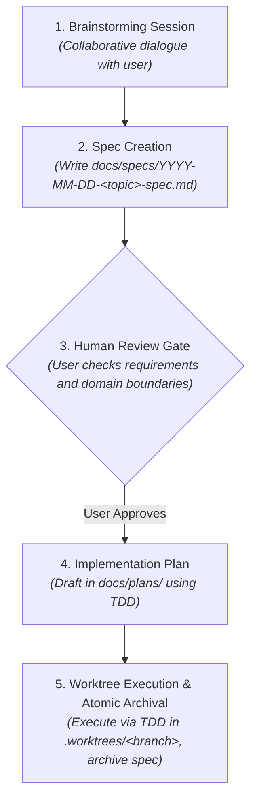

# Zero-Trust Agent-Proof Workflow & Repository Architecture Design

## 1. Overview & Motivation

When AI coding assistants or new contributors enter a codebase without explicit, structured boundaries, they encounter classic failure modes:
- **Context Drift**: Inventing ad-hoc conventions or guessing architecture patterns.
- **Accidental Architecture**: Introducing structural changes or dependencies silently within feature tasks without deliberate review.
- **Tribal Knowledge Gaps**: Failing to know why previous decisions were made (e.g., why Hexagonal Architecture, why inbound/outbound naming).
- **Stale Blueprint Confusion**: Reading historical implementation plans or completed specs and treating them as active or contradictory architectural sources of truth.

To solve this, Iny transitions to a **Zero-Trust, Agent-Proof Repository Architecture**. Any autonomous agent entering this repository will have complete context, unambiguous directory semantics, and strict operational guardrails enforced through `AGENTS.md` and `docs/ARCHITECTURE.md`.

---

## 2. The 3-Tier Documentation Structure

The repository establishes three strictly separated documentation tiers, each serving a distinct purpose with an explicit lifecycle:

| Documentation Tier | Target Path | Lifecycle / Mutability | Question Answered |
| :--- | :--- | :--- | :--- |
| **System Architecture** | `docs/ARCHITECTURE.md` | Living document; updated as system topology evolves | *"How does the entire engine fit together and where do new files belong?"* |
| **Feature Specifications (Specs)** | `docs/specs/` (active) `docs/specs/archive/` (past) | Active during feature dev; moved to `archive/` at the end of the PR right before merge | *"What business logic, edge cases, and API contracts define this feature?"* |
| **Implementation Plans (Plans)** | `docs/plans/` | Strictly ephemeral; gitignored | *"In what exact order do we write tests and code for this feature today?"* |

### 2.1. Spec Archival Semantics
- `docs/specs/`: Contains only active, in-flight feature specifications.
- `docs/specs/archive/`: Contains completed specifications preserved for historical domain context.
- **Atomic Within-PR Archival**: The active spec is moved to `docs/specs/archive/` at the very end of the implementation phase, **within the same feature branch/PR right before merging**. This guarantees that the change merges to `main` with its spec already archived, eliminating unnecessary follow-up PRs or direct pushes to `main`.
- **Precedence Rule**: Archived specs are point-in-time snapshots. They do **not** govern active architectural policy. If any archived specification conflicts with `docs/ARCHITECTURE.md` or the active codebase, `docs/ARCHITECTURE.md` and the active codebase take precedence.
- A dedicated `docs/specs/README.md` formally documents these semantics for incoming agents.

---

## 3. The Mandatory 5-Step Agent Development Lifecycle

Every code change (new feature, subsystem modification, or structural refactor) must follow a disciplined 5-step lifecycle:

### Step 1: Brainstorming Session
- Natural collaborative dialogue between the agent and the human partner.
- Clarifies requirements, scope, domain entities, and technical trade-offs before code is written.

### Step 2: Spec Creation
- The agent drafts `docs/specs/YYYY-MM-DD-<topic>-spec.md`.
- Focuses strictly on functional requirements, domain rules, edge cases, and API contracts.

### Step 3: Human Review Gate (Hard Stop)
- The agent presents the spec to the human partner for explicit review.
- **Hard Gate**: No implementation plan may be drafted until the human partner explicitly reviews and approves the spec.

### Step 4: Implementation Plan
- The agent drafts a step-by-step TDD implementation plan in `docs/plans/YYYY-MM-DD-<topic>-plan.md`.
- The plan outlines failing tests first (Red), minimal implementation (Green), and refactoring steps (Refactor).

### Step 5: Isolated Execution & Atomic Archival
- The agent creates an isolated git worktree in `.worktrees/<branch>`.
- The agent executes the plan with strict Red-Green-Refactor TDD.
- **Atomic Archival at Branch Conclusion**: At the very end of development—right before the PR is finalized and merged—the agent moves `docs/specs/YYYY-MM-DD-<topic>-spec.md` to `docs/specs/archive/YYYY-MM-DD-<topic>-spec.md` within the same branch. Ephemeral plans in `docs/plans/` are gitignored.

---

## 4. System Specifications

### 4.1. `AGENTS.md` (System Rules)
`AGENTS.md` establishes operational governance injected into agent contexts:
1. **Zero-Trust Baseline**: Mandatory reading of `docs/ARCHITECTURE.md` before taking action.
2. **The 3-Tier Documentation Structure**: Explicit definitions and roles of `docs/ARCHITECTURE.md`, `docs/specs/`, and `docs/plans/`.
3. **The 5-Step Lifecycle**: Brainstorming → Spec → Human Review Gate → Plan → Worktree Execution & Atomic Archival.
4. **Permanent Invariants**:
   - Hexagonal Purity: `src/core/` has zero runtime external dependencies.
   - Adapter Placement: Inbound in `src/adapters/inbound/`, outbound in `src/adapters/outbound/`.
   - Single Composition Root: `src/index.ts` is the runtime composition root.
   - Git Commits: Explicit human approval required; Conventional Commits format with mandatory explanatory body wrapped at 72 characters. Never commit directly to `main`.

### 4.2. `docs/specs/README.md`
A dedicated guide in `docs/specs/`:
- Defines active specs vs. `archive/`.
- Explains the atomic spec lifecycle (active during development, moved to `archive/` at the end of the feature PR right before merge).
- Enforces precedence of `docs/ARCHITECTURE.md` and active codebase over archived specs.

### 4.3. `docs/ARCHITECTURE.md` (System Architecture)
A comprehensive architectural document covering 6 core sections:
1. **System Vision & The Hexagonal Boundary**: Iny's purpose as a WhatsApp-first AI engine, Hexagonal architecture, pure domain core, and zero-trust philosophy.
2. **Mental Model & Core Concepts**: Definitions and code references for Entities, Use Cases, Ports, Inbound Adapters, Outbound Adapters, and Plugins.
3. **Codebase Directory Map**: Annotated tree of `src/` (`core/entities`, `core/errors`, `core/ports`, `core/use-cases`, `adapters/inbound`, `adapters/outbound`, `plugins/`, `config.ts`, `index.ts`).
4. **Canonical Control & Data Flow**: Complete end-to-end trace with Mermaid sequence diagram.
5. **Architectural Invariants**: Core dependency inversion, single composition root, and fail-fast startup configuration via Zod.
6. **"How Do I..." Recipe Guide**: Concrete step-by-step recipes for Inbound Adapters, Outbound Ports/Adapters, Plugins, and Feature Completion with Atomic Spec Archival.

---

## 5. File & Directory Reorganization Plan

1. **Specs Migration**:
   - Create `docs/specs/archive/`.
   - Move existing specs to `docs/specs/archive/`:
     - `docs/superpowers/specs/2026-09-13-iny-core-architecture-design.md`
     - `docs/superpowers/specs/2026-09-14-deepseek-adapter-design.md`
     - `docs/superpowers/specs/2026-09-15-logging-subsystem-design.md`
     - `docs/superpowers/specs/2026-09-15-plugin-registry-design.md`
   - Remove obsolete `docs/superpowers/` tree.
2. **Plans & Git Hygiene**:
   - Update `.gitignore` to ignore `docs/plans/*` and preserve `docs/plans/.gitkeep`.
3. **Architecture Documentation**:
   - Write `docs/specs/README.md`.
   - Write `docs/ARCHITECTURE.md`.
   - Update `AGENTS.md`.

---

## 6. Verification Criteria

- [x] All 4 historical specs are present under `docs/specs/archive/` and readable.
- [x] Obsolete `docs/superpowers/` directory is completely removed.
- [x] `.gitignore` contains `docs/plans/*` and preserves `.gitkeep`.
- [x] `docs/specs/README.md` clearly describes the active vs. archive spec lifecycle and precedence.
- [x] `AGENTS.md` contains the complete Zero-Trust Operating Contract and 5-step lifecycle.
- [x] `docs/ARCHITECTURE.md` contains all 6 core sections with accurate code symbol links and Mermaid control flow.
- [x] `npm run build` compiles with zero errors.
- [x] `npm test` runs and passes 100% of test suites.
