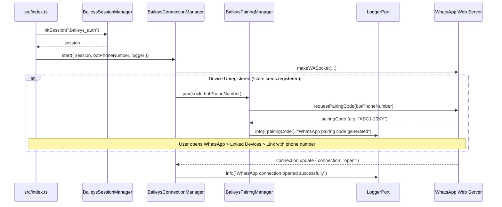
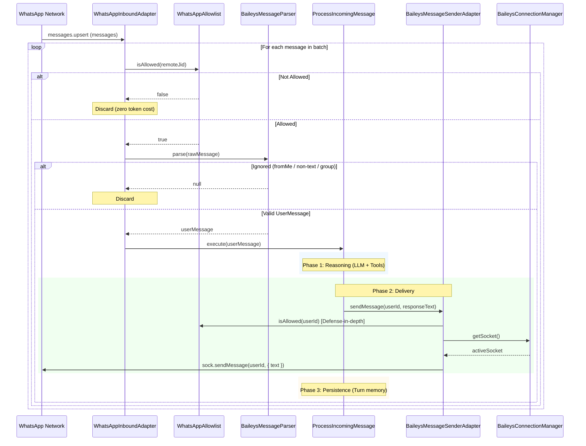

# Feature Specification: Baileys WhatsApp Integration

- **Status**: Completed
- **Date**: 2026-09-25
- **Author**: Antigravity & Pujan

---

## 1. Overview & Objectives

Iny is transitioning from a terminal CLI proof-of-concept into a live WhatsApp assistant. This specification establishes the foundational integration of [`@whiskeysockets/baileys`](https://github.com/WhiskeySockets/Baileys) to enable real-world message reception and delivery.

### Goals
1. Connect Iny to WhatsApp Web via Baileys WebSocket protocol using an 8-digit **Pairing Code** (compatible with structured JSON logging).
2. Persist session credentials locally in a gitignored `.baileys_auth/` directory to allow automatic reconnections without re-authenticating.
3. Establish a strict, config-driven **Allowlist** (`ALLOWED_USERS`) to prevent unsolicited messaging, group spam, and unauthorized LLM token consumption.
4. Implement clean Hexagonal adapters:
   - Outbound: `BaileysMessageSenderAdapter` implementing [`MessageSenderPort`](../../src/core/ports/MessageSenderPort.ts).
   - Inbound: `WhatsAppInboundAdapter` driving [`ProcessIncomingMessage`](../../src/core/use-cases/ProcessIncomingMessage.ts).
5. Remove the deprecated CLI adapter from production runtime to keep the codebase lean and free of dead code.

### Non-Goals (Future PRs)
- Media attachments, voice notes, stickers, reactions, and documents.
- Group chat support (`@g.us`) and broadcast channels (`status@broadcast`).
- Database-backed allowlist or multi-tenant user access management.

---

## 2. Architectural Boundaries & Component Decomposition

To adhere strictly to Clean Architecture, Hexagonal invariants, and the Single Responsibility Principle (SRP), the WhatsApp integration is decomposed into six focused collaborators:

```text
src/
├── adapters/
│   ├── inbound/
│   │   └── whatsapp/
│   │       ├── WhatsAppInboundAdapter.ts         # Driving adapter: binds to Baileys events, invokes ProcessIncomingMessage
│   │       └── BaileysMessageParser.ts           # Pure parser: extracts text and validates raw WAMessage payloads
│   ├── outbound/
│   │   └── whatsapp/
│   │       ├── BaileysMessageSenderAdapter.ts    # Driven adapter: implements MessageSenderPort with allowlist safety
│   │       ├── BaileysConnectionManager.ts       # Socket lifecycle coordinator: connection.update, reconnects
│   │       ├── BaileysSessionManager.ts          # Session persistence lifecycle: credentials storage & purge
│   │       └── BaileysPairingManager.ts          # Device pairing coordinator: pairing code generation via pair()
│   └── common/
│       ├── access-control/
│       │   └── WhatsAppAllowlist.ts          # Pure access control: permission check against allowed JIDs
│       └── whatsapp/
│           └── WhatsAppJid.ts                # Pure collaborator: WhatsApp JID validation & normalization
├── config.ts                                 # Validates BOT_PHONE_NUMBER and ALLOWED_USERS
└── index.ts                                  # Composition root: wires WhatsApp adapters into ProcessIncomingMessage
```

### Component Responsibilities

1. **`WhatsAppJid` (Pure Logic)**:
   - Validates and normalizes raw phone numbers and JID strings into standard `number@s.whatsapp.net` format.
   - Rejects non-individual chats such as group JIDs (`@g.us`), status broadcasts (`status@broadcast`, `@broadcast`), and non-numeric identifiers.

2. **`WhatsAppAllowlist` (Pure Logic)**:
   - Enforces access control authorization by verifying identities against the configured allowed users set.
   - Delegates JID normalization and syntax validation to `WhatsAppJid`.

3. **`BaileysMessageParser` (Pure Translation)**:
   - Inspects raw Baileys `proto.IWebMessageInfo` (`WAMessage`).
   - Ignores self-messages (`key.fromMe === true`).
   - Ignores non-direct chats (`remoteJid` ending in `@g.us` or equal to `status@broadcast`).
   - Extracts plain text content from `message.conversation` or `message.extendedTextMessage.text`.
   - Returns a domain `UserMessage` entity `{ id, userId, content, timestamp, role }`.

4. **`BaileysSessionManager` (Infrastructure)**:
   - Initializes `useMultiFileAuthState('.baileys_auth')`.
   - Purges session credentials directory via `fs.promises.rm` upon device logout (401).

5. **`BaileysPairingManager` (Infrastructure)**:
   - When credentials are not yet registered (`!creds.registered`), coordinates first-time device pairing via `pair(sock, botPhoneNumber)`.
   - Sanitizes phone digits and requests an 8-character pairing code via `sock.requestPairingCode(cleanPhone)`.
   - Emits structured log with the pairing code for pairing via WhatsApp Linked Devices.

6. **`BaileysConnectionManager` (Infrastructure)**:
   - Instantiates `makeWASocket` with Baileys configuration.
   - Coordinates `connection.update` (`open`, `connecting`, `close`) and delegates pairing to `BaileysPairingManager.pair()`.
   - Evaluates disconnect status codes via `@hapi/boom` and delegates session teardown to `BaileysSessionManager.purgeSession()`.
   - Exposes clean methods to access the active socket (`getSocket()`, `isConnected()`).

7. **`WhatsAppInboundAdapter` (Inbound Driving Adapter)**:
   - Subscribes to `sock.ev.process` on `messages.upsert` with `type === 'notify'`.
   - Filters messages through `WhatsAppAllowlist` and `BaileysMessageParser`.
   - Dispatches valid messages asynchronously to `ProcessIncomingMessage.execute(userMessage)`.

8. **`BaileysMessageSenderAdapter` (Outbound Driven Adapter)**:
   - Implements [`MessageSenderPort`](../../src/core/ports/MessageSenderPort.ts).
   - Validates recipient JID against `WhatsAppAllowlist` as a defense-in-depth safety barrier.
   - Retrieves active socket via `BaileysConnectionManager.getSocket()` and transmits message via `socket.sendMessage(userId, { text: content })`.
   - Throws descriptive transport errors if the socket is disconnected or delivery fails.

---

## 3. Data Flow & Processing Lifecycle

### 3.1 Startup & Authentication Flow



### 3.2 Message Processing & Delivery Pipeline



---

## 4. Error Handling & Reconnection Matrix

When `connection.update` reports `{ connection: 'close', lastDisconnect }`, the HTTP status code is resolved via `(lastDisconnect?.error as Boom)?.output?.statusCode`:

| Disconnect Code | Cause | Automated Action |
| :--- | :--- | :--- |
| **`DisconnectReason.restartRequired` (515)** | Normal WhatsApp server protocol restart. | Re-invoke socket factory immediately with existing credentials. |
| **`connectionClosed` (428)** | Socket closed unexpectedly. | Auto-reconnect with linear/exponential backoff. |
| **`connectionLost` (408) / `timedOut` (408)** | Transient network timeout. | Auto-reconnect with linear/exponential backoff. |
| **`DisconnectReason.loggedOut` (401)** | WhatsApp session unlinked by user. | Log fatal error, purge `.baileys_auth/` directory, abort reconnection to prevent infinite 401 loop. |
| **`DisconnectReason.badSession` (500)** | Session corruption. | Log fatal error requiring manual restart. |

### Transport Failure Invariant
If `sock.sendMessage()` fails during network interruption, `BaileysMessageSenderAdapter` throws an error. [`ProcessIncomingMessage`](../../src/core/use-cases/ProcessIncomingMessage.ts) catches this error in Phase 2 (Delivery Phase) and aborts before Phase 3 (Persistence Phase), guaranteeing that failed turns are never saved to history.

---

## 5. Configuration & Environment Variables

Update `src/config.ts` with Zod schema validation:

```typescript
BOT_PHONE_NUMBER: z
  .string()
  .regex(/^\d+$/, 'BOT_PHONE_NUMBER must contain digits only with country code'),

ALLOWED_USERS: z
  .string()
  .transform((val) =>
    val
      .split(',')
      .map((s) => s.trim())
      .filter(Boolean)
  )
  .pipe(z.array(z.string()).min(1, 'At least one allowed user must be configured')),
```

Example `.env`:
```env
BOT_PHONE_NUMBER=15551234567
ALLOWED_USERS=15559876543,15550001111@s.whatsapp.net
```

---

## 6. Deprecations & Removals

- Remove `src/adapters/inbound/cli/CLIAdapter.ts` and `src/adapters/inbound/cli/CLIAdapter.test.ts`.
- Update `src/index.ts` to replace CLI startup with `WhatsAppInboundAdapter.start()`.
- Add `.baileys_auth/` to `.gitignore`.

---

## 7. Testing & Verification Plan

All unit and integration tests must run 100% offline with zero live network calls:

1. **`WhatsAppJid.test.ts`**:
   - Verify phone number normalization to `@s.whatsapp.net`.
   - Verify handling of formatted numbers with symbols and whitespace.
   - Verify rejection of group JIDs (`@g.us`), status broadcasts (`status@broadcast`), and invalid strings.

2. **`WhatsAppAllowlist.test.ts`**:
   - Verify allowed numbers and JIDs return `true`.
   - Verify unlisted numbers return `false`.
   - Verify rejection of non-allowed entities and empty allowlists.

3. **`BaileysMessageParser.test.ts`**:
   - Verify `fromMe: true` returns `null`.
   - Verify group messages (`@g.us`) return `null`.
   - Verify status broadcasts return `null`.
   - Verify non-text payloads (media/reactions) return `null`.
   - Verify standard conversation text returns valid `UserMessage`.
   - Verify extended text message with quotes returns valid `UserMessage`.

4. **`BaileysMessageSenderAdapter.test.ts`**:
   - Verify rejection if recipient is not in allowlist.
   - Verify calls `socket.sendMessage(jid, { text })` when authorized and connected.
   - Verify throws error when socket is disconnected.
   - Verify propagation and logging of transport errors when delivery fails.

5. **`WhatsAppInboundAdapter.test.ts`**:
   - Verify unauthorized messages never invoke `ProcessIncomingMessage.execute()`.
   - Verify valid authorized messages trigger `ProcessIncomingMessage.execute(userMessage)`.

6. **`BaileysConnectionManager.test.ts`**, **`BaileysSessionManager.test.ts`** & **`BaileysPairingManager.test.ts`**:
   - Verify device pairing via `pair()` when `registered: false`.
   - Verify reconnection triggers for code `515`, `428`, `408`.
   - Verify session purge on code `401` via `purgeSession()`.
