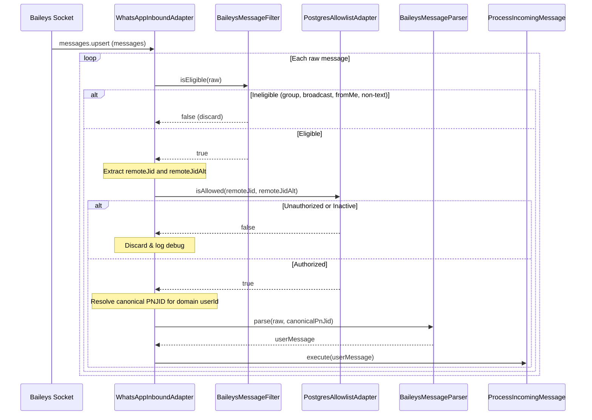

# Specification: Persistent PostgreSQL WhatsApp Allowlist & Native LID Resolution

**Status:** Draft  
**Date:** 2026-09-30  
**Authors:** Pujan Khunt, Antigravity AI  

---

## 1. Context & Business Motivations

Iny currently manages authorized users via a static comma-separated environment variable (`ALLOWED_USERS`) loaded on startup into an in-memory `WhatsAppAllowlist` (`Set<string>`). 

This architecture presents two major limitations:
1. **Static Access Control**: Adding or revoking users requires editing `.env` on the host and restarting the entire Docker container stack. There is no persistent database audit trail or metadata (e.g. user names, roles, or active status) stored for authorized callers.
2. **The WhatsApp LID Blindspot**: In modern WhatsApp (and `@whiskeysockets/baileys` 7.x), WhatsApp delivers incoming direct messages using **LID (Linked Identity JID - `@lid`)** by default instead of the user's phone number (**PNJID - `@s.whatsapp.net`**) to protect privacy. Currently, `WhatsAppJid.normalize` strictly rejects `@lid` addresses. When a user sends a message from a modern WhatsApp client, Iny fails to normalize the identifier, rejects the user as unauthorized, and drops the message. Furthermore, if `remoteJid` flips between LID and PN, conversation memory in `dialogue_turns` becomes fragmented under different `userId`s.

This specification designs a **PostgreSQL-backed allowlist subsystem** with **native Baileys JID/LID duality resolution**, enabling dynamic user management via SQL/Drizzle Studio while ensuring robust, seamless message routing across both phone numbers and LIDs.

---

## 2. Architectural Boundaries & Hexagonal Invariants

Following Iny's Hexagonal Architecture:
- **Core Domain (`src/core/`)**:
  - Remains 100% pure TypeScript with zero external runtime dependencies.
  - The domain `UserMessage` entity continues to use a canonical `userId` string (`<digits>@s.whatsapp.net`).
- **Access Control Adapter Boundary (`src/adapters/outbound/access-control/`)**:
  - The new persistent allowlist lives in `src/adapters/outbound/access-control/postgres/`.
  - Defines an `AllowlistPort` interface ensuring clean dependency inversion.
- **Inbound & Outbound Adapters**:
  - `WhatsAppInboundAdapter` (driving inbound adapter) resolves the sender to their canonical PNJID before checking authorization against `AllowlistPort`.
  - `BaileysMessageSenderAdapter` (driven outbound adapter) verifies authorization against `AllowlistPort` defense-in-depth prior to socket transmission.
- **Composition Root (`src/index.ts`)**:
  - Remains the sole orchestrator wiring the database connection pool into the allowlist adapter and injecting it into inbound and outbound transports.

---

## 3. Database Schema: `allowed_users` Table

A new table `allowed_users` will be defined using Drizzle ORM in `src/adapters/outbound/access-control/postgres/schema.ts`:

### Columns
| Column Name | PostgreSQL Type | Nullable | Default | Description |
|---|---|---|---|---|
| `phone_number` | `TEXT` | No | Primary Key | Normalized phone number with country code, digits only (e.g. `'919876543210'`). |
| `jid` | `TEXT` | No | Unique | Canonical WhatsApp Phone Number JID (e.g. `'919876543210@s.whatsapp.net'`). |
| `lid` | `TEXT` | Yes | Null | Paired WhatsApp Linked Identity JID (e.g. `'123456789012345@lid'`). Dynamically cached on first contact. |
| `name` | `TEXT` | Yes | Null | Friendly display name or college student/staff identifier (e.g. `'Pujan Khunt'`). |
| `role` | `TEXT` | No | `'user'` | Role classification for future permissions (`'admin'` vs `'user'`). |
| `is_active` | `BOOLEAN` | No | `true` | Soft deletion/revocation flag. If `false`, access is immediately blocked. |
| `created_at` | `TIMESTAMPTZ` | No | `now()` | Timestamp when the user was initially granted access. |
| `updated_at` | `TIMESTAMPTZ` | No | `now()` | Timestamp of last modification (e.g., LID caching or revocation). |

### Table Constraints & Indexes
1. **Primary Key**: `PRIMARY KEY (phone_number)`
2. **Unique Index on `jid`**: `CREATE UNIQUE INDEX idx_allowed_users_jid ON allowed_users (jid);`
3. **Unique Index on `lid`**: `CREATE UNIQUE INDEX idx_allowed_users_lid ON allowed_users (lid) WHERE lid IS NOT NULL;`
4. **Index on `is_active`**: `CREATE INDEX idx_allowed_users_is_active ON allowed_users (is_active);`
5. **Check Constraint on `phone_number`**: `CHECK (phone_number ~ '^[0-9]+$')`
6. **Check Constraint on `role`**: `CHECK (role IN ('admin', 'user'))`

---

## 4. Modernized JID & LID Classification Utility

Refactor `src/adapters/common/whatsapp/WhatsAppJid.ts` to delegate directly to `@whiskeysockets/baileys` built-in utility functions:

1. **JID Normalization**:
   - `WhatsAppJid.normalize(raw)`:
     - Accepts raw phone numbers (e.g. `'+91 (987) 654-3210'`), PNJIDs (`'919876543210@s.whatsapp.net'`), and LIDJIDs (`'123456789012345@lid'`).
     - Uses Baileys' `jidNormalizedUser(jid)` to strip multi-device suffixes (e.g. `:2@s.whatsapp.net` $\rightarrow$ `@s.whatsapp.net`, `:1@lid` $\rightarrow$ `@lid`).
     - Normalizes raw digit strings to `<digits>@s.whatsapp.net`.
2. **Entity Classification**:
   - `WhatsAppJid.isUser(jid)`: Returns `true` if `isPnUser(jid)` OR `isLidUser(jid)`.
   - `WhatsAppJid.isGroup(jid)`: Delegates to Baileys' `isJidGroup(jid)`.
   - `WhatsAppJid.isBroadcast(jid)`: Delegates to Baileys' `isJidBroadcast(jid)`.
   - `WhatsAppJid.toPhoneNumber(jid)`: Extracts clean digits from a PNJID or returns `null` if given a non-PN address.

---

## 5. Persistent Allowlist Adapter Specification

### Interface Definition
```typescript
export interface AllowedUserRecord {
  phoneNumber: string;
  jid: string;
  lid: string | null;
  name: string | null;
  role: 'admin' | 'user';
  isActive: boolean;
  createdAt: Date;
  updatedAt: Date;
}

export interface AllowlistPort {
  /**
   * Verifies whether an incoming address (PNJID, LIDJID, or phone number)
   * is actively authorized to access Iny.
   *
   * If the user is authorized and the incoming message provides an LID that was
   * not previously cached, schedules an asynchronous update to store the LID.
   */
  isAllowed(address: string, pairedLid?: string | null): Promise<boolean>;

  /**
   * Retrieves full user record by phone number, JID, or LID.
   */
  getUser(address: string): Promise<AllowedUserRecord | null>;

  /**
   * Seeds initial administrator users from configuration into the database.
   * Existing entries are never overwritten (ON CONFLICT DO NOTHING).
   */
  seedUsers(entries: string[]): Promise<void>;

  /**
   * Returns the count of active allowed users currently in the database.
   */
  countActiveUsers(): Promise<number>;

  /**
   * Updates the paired LID for an existing user record.
   */
  cacheLid(phoneNumber: string, lid: string): Promise<void>;
}
```

### Runtime Verification Flow
1. Normalize incoming `address` using `WhatsAppJid.normalize(address)`.
2. Query PostgreSQL with indexed $O(1)$ lookup:
   ```sql
   SELECT phone_number, jid, lid, is_active, role 
   FROM allowed_users 
   WHERE (jid = $1 OR lid = $1 OR phone_number = $1)
   LIMIT 1;
   ```
3. If no row is returned or `is_active === false`, return `false`.
4. If `row.lid === null` and `pairedLid` is provided (and valid):
   - Trigger an asynchronous `UPDATE allowed_users SET lid = $lid, updated_at = now() WHERE phone_number = $phone` without blocking message processing.
5. Return `true`.

---

## 6. Message Processing & Identity Normalization Flow

### Inbound Message Handling (`WhatsAppInboundAdapter`)


1. **Alternate JID Extraction**:
   - `remoteJid = raw.key.remoteJid`
   - `remoteJidAlt = raw.key.remoteJidAlt`
   - If `remoteJid` is a LID, `pairedLid = remoteJid` and search candidate is `remoteJidAlt` (if present) or `remoteJid`.
2. **Canonical Domain ID**:
   - `UserMessage.userId` is ALWAYS guaranteed to be the canonical PNJID (`<phone>@s.whatsapp.net`).
   - If a message arrives as `@lid` and Baileys has `remoteJidAlt`, `userId` is set to `remoteJidAlt`.
   - If `remoteJidAlt` is not on the key, `PostgresAllowlistAdapter.getUser(remoteJid)` returns the user's `jid` (`@s.whatsapp.net`).
   - Result: `dialogue_turns` conversation memory in PostgreSQL is **100% unified and never fragmented by LID changes**.

### Outbound Message Handling (`BaileysMessageSenderAdapter`)
- Before dispatching via `socket.sendMessage(userId, { text })`, verifies `await this.allowlist.isAllowed(userId)`.
- Because Baileys natively accepts PNJIDs (`@s.whatsapp.net`) and handles internal LID translation, transmission requires no extra transformation.

---

## 7. Startup Bootstrapping & Fail-Fast Safety

In `src/index.ts`:
1. **Migrations**: Database startup migrations run first via `runStartupMigrations()`.
2. **Seeding**:
   - Reads `config.ALLOWED_USERS`.
   - If populated, normalizes entries and executes:
     ```sql
     INSERT INTO allowed_users (phone_number, jid, name, role, is_active)
     VALUES ($phone, $jid, 'Initial Admin', 'admin', true)
     ON CONFLICT (phone_number) DO NOTHING;
     ```
   - Existing database records and revocations (`is_active = false`) are **never overwritten**.
3. **Fail-Fast Safety Check**:
   - Query `allowlist.countActiveUsers()`.
   - If active count is 0:
     - Log fatal error: `"Fatal: No active allowed users found in PostgreSQL and no ALLOWED_USERS configured in .env."`
     - Process exits with code 1. Prevents running Iny in an unconfigured zombie or insecure state.
4. **Environment Configuration Update**:
   - Update `src/config.ts`: `ALLOWED_USERS` transforms empty or missing strings into an empty array (`[]`) instead of throwing validation errors, allowing deployments to transition to 100% database-driven user management once initialized.

---

## 8. Test Strategy & Invariants

1. **Pure Unit Tests**:
   - Modernized `WhatsAppJid.test.ts`:
     - Phone number normalization (clean digits, stripped symbols).
     - Multi-device suffix stripping (`:1@s.whatsapp.net`, `:2@lid`).
     - PNJID and LIDJID classification (`isUser`, `isGroup`, `isBroadcast`).
     - Rejection of invalid stanzas and empty strings.
2. **Adapter Database Tests (100% Deterministic & Offline via `pg-mem`)**:
   - `PostgresAllowlistAdapter.test.ts`:
     - Initial seeding with `ON CONFLICT DO NOTHING`.
     - Fast authorization lookup by PNJID, LIDJID, and raw phone number.
     - Rejection of inactive (`is_active = false`) users.
     - Asynchronous one-time LID caching and idempotency on subsequent messages.
     - Empty database count and fail-fast triggers.
3. **Integration & Regression Tests**:
   - `WhatsAppInboundAdapter.test.ts`: Verified with both PNJID messages and LID messages with `remoteJidAlt`.
   - `BaileysMessageSenderAdapter.test.ts`: Verified asynchronous permission checking.
   - All 196 existing unit tests pass without regression.
